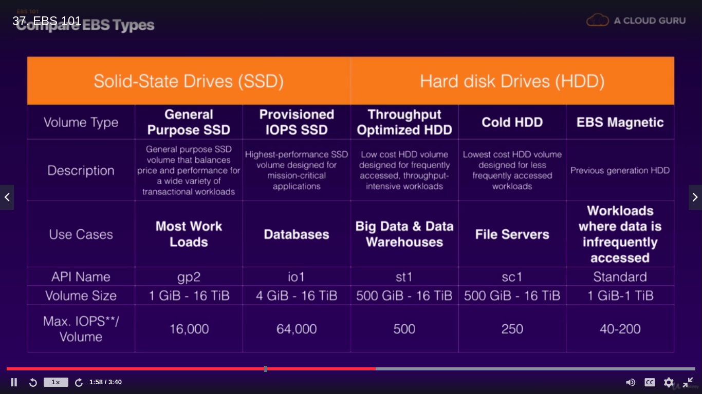

EC2(Elastic compute cloud)

EC2 provides web based virtual machine computing and resizable
Amazon machine image(AMI)

Connect to machine
chmod 400 ~/aws/sada_aws_key.pem
ec2-54-208-121-141.compute-1.amazonaws.com
ssh -i "/home/sadashiv/aws/sada_aws_key.pem" ec2-user@ec2-54-208-121-141.compute-1.amazonaws.com

Windows
https://chrome.google.com/webstore/detail/secure-shell-app/pnhechapfaindjhompbnflcldabbghjo?hl=en
chrome://apps/

IOPS(Input Output per second)
In storage Root device volume can be encrypted

Termination protection is turned off by default, you must turn it on.
On EBS-backed instance, the default action is for the Root EBS volume to be deleted when the instance is terminated.
Additional volume won't be deleted by default.
EBS Root volumes of your default AMI's can be encrypted. you can also use a third party tool(such as bitlocker etc) to encrypt the
root volume, or this can be done when creatin AMI's(lab to fallow) in the AWS console or using the API.

All inbound traffic is blocked by default
All outbound traffic is allowed
Changed to security groups take effect immediately
You can have any number of EC2 instances within a security group
You can have multiple security groups attached to EC2 instances
Secuirty groups are STATEFUL

If you create and inbound rule allowing traffic in, that traffic is automatically allowed back out again.
You cannot block speicifc IP Addresses using security groups, instead use network Access control Lists
You can specify allow rules, but not deny rules.

Amazon Elastic block storage(EBS)
5 different types of EBS storage
- General purpose SSD
- Provisoned IOPS SSD
- Throughput optimized HDD
- Cold HDD
- EBS magnetic

EBS volume will availabel in same zone as EC2 instance zone
- Volume exist on EBS volume.Think of EBS as virtual hard disk
- Snapshots exist on S3. Think of snapshot as photograph of the disk
- Snapshots are point in time copies volumes
- Snapshots are incremental - This means that only the blocks that have changed since your last snapshots are moved to S3
- To create a snapshot for Amazon EBS voluems the serve as root devices, you should stop the instance before taking the snapshot.
- However you can take snapshot while instance is running
- You can create AMI's from snapshots
- You can change EBS volume sizes on the fly, inlcuding changing the size and storage type
- To move an EC2 voulem from one availiblity zone to another, take a snapshot of it, create an AMI from the snapshot and then use the
- AMI to launch the EC2 instance in new availiblity zone
- To move an EC2 volume from one region to another, take snapshot of it, create an AMI from the snapshot and the copy the AMI from
- one region to another. Then use the copied AMI to launch the new EC2

- Instance store volumes are sometimes called Ephemeral storage
- Instance store volumes cannot be stopped. If the underlying host fails. you will lose your data
- EBS backed instances can be stopped.you will not lose the data on this instance if it is stopped
- You can reboot both, you will not loose your data
- By default both ROOT volumes will be deleted on termination. However, with EBS volumes, you can tell AWS to keep the root device volume.

ENI vs EN vs EFA
- ENI(Elastic network interface)
  For basic networking. perhaps you need seperate management network to your production network or seperate logging network and 
  you need to do this at low cost. In this scenario use multiple ENIs for each network.

- Enhanced network(EN)
  For when you need speeds between 10Gbps and 100Gbps, Anywhere you need reliable, high throughput.

- Elastic Fabric Adaptor
  For when you need to accelrate High performance computing(HPC) and machine learning applications or if you need to do and OS by-pass.
  If you see scenario question mentioning HPC or ML and asking what  network adaptor you want, choosee EFA.

Encrypted Root Device Volume and Snapshots
- Snapshots of encrypted volumes are encrypted automatically.
- Volumes restored from encrypted snapshots are encrypted automatically
- You can share snapshots, but only if they are unencrypted
- These snapshots can be shared with other AWS accounts or made public
- Create a snapshot from the unencrypted root device volume
- Create a copy of snapshot and select encrypt option
- Create an AMI from the encrypted snapshot
- Use that AMI to launch new encrypted instances

Spot instances and Spot fleets

EC2 Hibernate
- EC2 Hibernate preserves the in-memory RAM on persistent storage(EBS)
- Much faster to boot up because you do not need to reload the oprating system
- Instance RAM must be less than 150GB
- Instance families include C3,C4,C5,M3,M4,M5,R3,R4 and R5
- Available for Windows, Amazon linux 2 AMI and UBUNTU
- Instances can't be hibernated for more than 60days
- Availble for On-Demand instances and Reserved instances

- Cloud Watch is used for monitoring performance
- Cloud watch can monitor most of AWS as well as your applications that run on AWS
- CloudWatch with EC2 will monitor events every 5minutes by default
- You can have one minute interval by truning on detailed monitoring
- You can create cloudwatch alarms which trigger notifications
- Cloudwatch is all about monitoring performance. CloudTrail monitors API calls and auditing AWS account

CloudWatch
- Standarad monitoring is 5 minute
- Detailed monitoring is 1 minute

- Dashboards - Create awesome dashboards to see what is happening with your environment region specific
- Alarms - Allows you to set alarm that notify you when particular thresholds are hit
- Events - CloudWatch Events helps you to respond to state change in you aws resources
- Logs - CloudWatch logs helps you aggregate, monitor, and store logs

$ aws s3 ls
Unable to locate credentials. You can configure credentials by running "aws configure".
$ aws configure 
AWS Access Key ID [None]:
AWS Secret Access Key [None]:
Default region name [None]: us-east-1
Default output format [None]: 

$ aws s3 ls
2020-12-25 11:33:44 sadashiv
2020-12-26 12:51:41 sadashivreplicationbucket

$ aws s3 mb s3://sandy
make_bucket failed: s3://sandy An error occurred (BucketAlreadyExists) when calling the CreateBucket operation: The requested bucket name is not available. The bucket namespace is shared by all users of the system. Please select a different name and try again.

$ aws s3 mb s3://suraj
make_bucket: suraj 

$ aws s3 ls
2020-12-30 04:43:03 suraj
2020-12-25 11:33:44 sadashiv
2020-12-26 12:51:41 sadashivreplicationbucket

Using IAM roles with EC2
Create role and and attach the running instance in that case not required make have AWS Access Key ID and secret access key
$ aws s3 ls
2020-12-30 04:43:03 django
2020-12-25 11:33:44 sadashiv
2020-12-26 12:51:41 sadashivreplicationbucket

- Roles are more secure that storing your access key and secret access key on individual EC2 instances
- Roles are much easier to manage
- Roles can be assigned to EC2 instance after it is created using both console and command line
- Roles are universal-You can use them in any region

Using Bootstrap Scripts

We have to select IAM role created

In Advanced select
#!/bin/bash
yum update -y
yum install httpd -y
service httpd start
chkconfig httpd on
cd /var/www/html
echo "<html><h1>Hello Sadashiv Welcome To My Webpage</h1></html>" > index.html
aws s3 mb s3://sadashiv12345
aws s3 cp index.html s3://sadashiv12345

curl http://18.234.149.46/latest/user-data
curl http://18.234.149.46/latest/meta-data
curl http://18.234.149.46/latest/meta-data/local-ipv4

Elastic file system(EFS)
- Support the newtork file system version 4(NFSv4) protocol
- You only pay for the storage you use(no pre-provisioning required)
- Can scale up to the petabytes
- Can support thousands of concurrent NFS connections
- Data is stored across multiple AZ's within region
- Read after Write Consistency

Amazon FSx for windows file server
 EFS - When you need distributed, highly resilient storage for linux instances and Linux based applications.
 Amazon FSx for windows - (Server message Block SMB)When you need centralised storage for Windows based application
                           such as sharepoint, MicrosoftSQL server, Workspaces, IIS webserver or any native microsoft application
 Amazon FSx for lustre - When you need high speed high capacity distributed storage,This will be for application  that to high
                         performance compute(HPC) financial modelling etc. Remember that FSx for Lustre can store data directly on S3

Placement Groups
    - Clustered placement group - Grouping of instances within single AZ
        Low network latency/High network throughput
    - Spread placement group - Group of instances that are each placed on distinct underlying hardware
        Individual critical instances
    - Partitioned - Simliar to Spread placement group Amazon EC2 partition within placement group has it own set of racks
        Multiple EC2 instances HDFS, HBase and Cassandra

We achieve HPC on AWS through
- Data transfer
- Computing and Networking
- Storage
- Orchestration and automation

Data transfer
- Snoball, Snowmobile(terabytes/petabytes worth of data)
- AWS DataSync to store on S3, EFS, FSx, for windows etc.
- Direct connection

Compute and Networking
- EC2 instances that are GPU or CPU optimized
- EC2 fleets(Spot instances or Spot fleets)
- Placement groups(Cluster placement groups)
- Enhanced networking single root I/O virtualization(SR-IOV)
- Elastic network adapters or Intel 82599 Virtual function(VF) interface
- Elastic fabric Adapters

Storage
Instance attached storage
    EBS - Scale up to 64,000 IOPS with Provisioned IOPS(PIOPS)
    Instance store - Scale to millions of IOPS; low latency

Network storage
    Amazon S3: Distributed object based storage; not file system
    Amazon EFS: Scale IOPS based on total size, or use provisioned IOPS
    Amazon FSx for lustre: HPHC optimized distributed file system; millions of IOPS, which is also backed by S3

Orchestration and Automation
- AWS batch
- AWS Parallel cluster

AWS WAF(amazon web application firewall)

